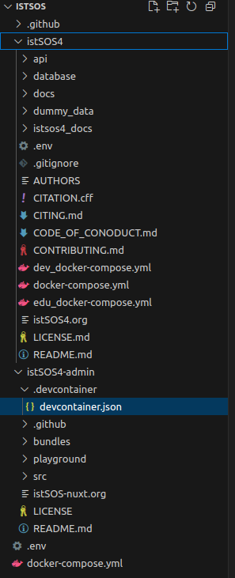

# istSOS4-Nuxt

**Nuxt Layers and Modules authored to adhere to uncomplicate dependencies and to silo complex relationships. Designed around SensorThings API and structured to administer the interconnection of the Internet of Things devices, data, and applications over nuxt client-server application, with stylistic conventions of deno and typescript. Pinia ORM models and relationships combined with the Pinia stores offer vertical slices to group domain-based features for entity relationships and spatial predicates.**

### Other istSOS4 projects
  - istSOS4 backend
    - fastapi + geoalchemy + postgis + redis
  - istSOS4-grafana
  - istSOS4-gui
    - Next.js alternative to this project
  - istSOS-wizard

- Code idioms occur at all levels of granularity:
  - naming functions
  - types
  - parameters
  - modules
  - layouts
  - layers (code locations)
  - structure of modules
  - choice of infrastructure/toolings
  - dependency management
 
- istSOS idioms
  - [**Project Steering Committee**](https://istsos.org/psc.html)
  - FAIR principles
  - CARE principles
  - INSPIRE principles

- Nuxt.js ( v4 compatability)
  - [Nuxt-MCP](https://github.com/antfu/nuxt-mcp)
  - [Nuxt-llms](https://github.com/nuxtlabs/nuxt-llms)
  - Nuxt Dev Tools
- Axios & H3
- TailwindCSS
- DaisyUI
- Pinia
- Pinia-ORM

# DevContainer

My workspace is setup to compose the istSOS4 and istSOS4-admin services.

  
## Synopsis
This project aims to develop a web-based administration interface for istSOS, making it easier to manage and monitor SensorThings API components. The interface will provide a user-friendly way to register, for example, new Sensors and Things, set metadata, and monitor sensor metrics such as received data, transmission delays, and overall system health.

## [istSOS.](https://istsos.org/)
### What is istSOS?
**An [OGC SOS](https://www.ogc.org/standards/sos/) server implementation written in Python, distributed under the GPL v2 license.**

### Benefits to the Community
Simplified Sensor Management: Users will be able to register, update, and manage SensorThings API components through an intuitive web interface.
Improved Monitoring & Control: The interface will offer real-time insights into sensor performance, data reception status, and potential transmission delays.
Enhanced Usability: Eliminates the need for complex API interactions, making istSOS more accessible to researchers, engineers, and IoT enthusiasts.

### Deliverables
A fully functional web UI for managing istSOS SensorThings components.
Features for SensrThingsAPI entities (sensor, things, etc.) registration, metadata configuration, and system status monitoring.
Visual analytics on sensor data reception, delays, and health status.
Comprehensive documentation and user guides for easy adoption.

## Why This Matters?
Currently, managing istSOS SensorThings API components requires manual API interactions. This project will provide a more intuitive and efficient way to administer istSOS instances, making sensor registration and monitoring more accessible and user-friendly for a broader audience.
